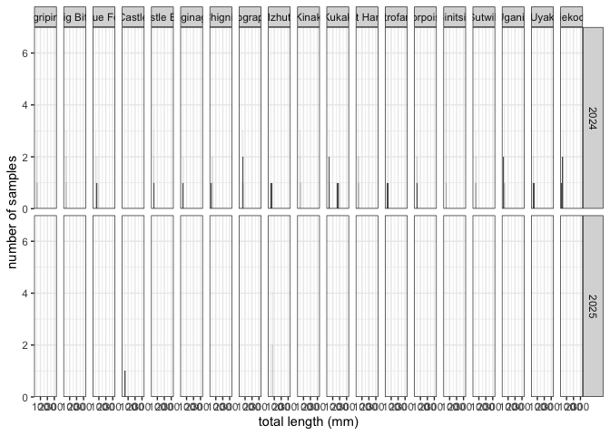
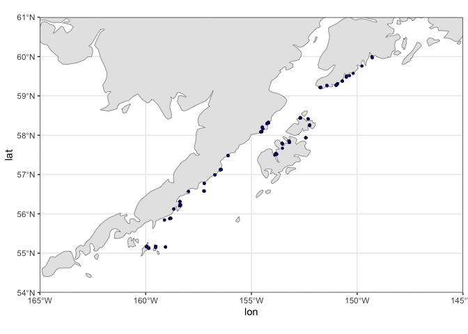
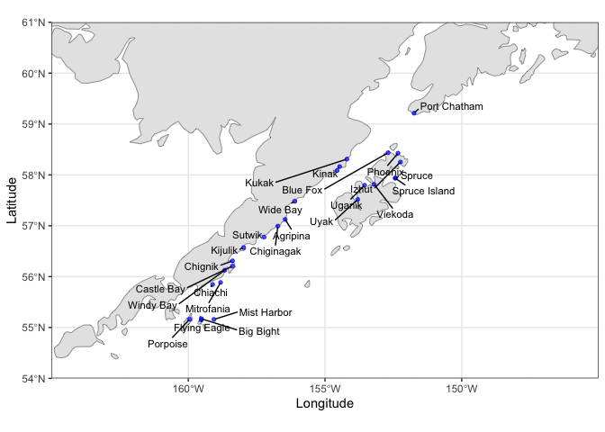
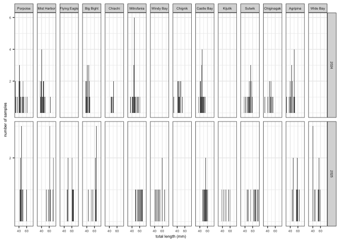
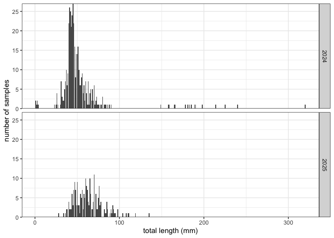
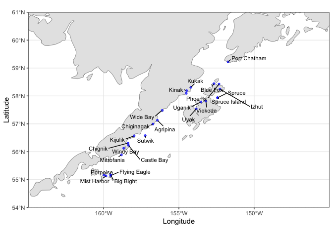
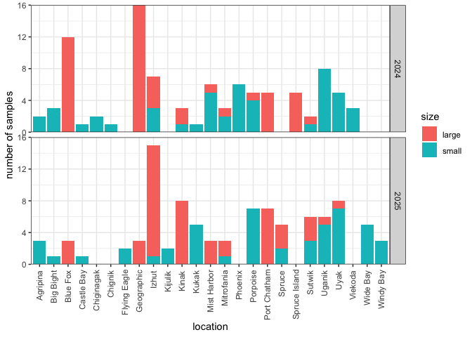

01-sample-summary
================
diana baetscher
2025-12-03

``` r
library(tidyverse)
```

    ## ── Attaching core tidyverse packages ──────────────────────── tidyverse 2.0.0 ──
    ## ✔ dplyr     1.1.4     ✔ readr     2.1.4
    ## ✔ forcats   1.0.0     ✔ stringr   1.5.1
    ## ✔ ggplot2   3.5.1     ✔ tibble    3.2.1
    ## ✔ lubridate 1.9.3     ✔ tidyr     1.3.1
    ## ✔ purrr     1.0.2     
    ## ── Conflicts ────────────────────────────────────────── tidyverse_conflicts() ──
    ## ✖ dplyr::filter() masks stats::filter()
    ## ✖ dplyr::lag()    masks stats::lag()
    ## ℹ Use the conflicted package (<http://conflicted.r-lib.org/>) to force all conflicts to become errors

``` r
library(readxl)


# load data
samps24 <- read_xlsx("../data/2024FinClipsforGenetics.xlsx", sheet = "Samples")
samps25 <- read_xlsx("../data/2025GeneticsSamples.xlsx", sheet = "Samples")
```

``` r
df24 <- samps24 %>%
  filter(Species == "Pacific cod") %>%
  filter(`Total Length` != "?") %>%
  mutate(length = as.numeric(`Total Length`)) %>%
  mutate(year = "2024") %>%
  rename(lon = Long, lat = Lat)

comb_df <- samps25 %>%
  filter(Species == "PCOD") %>%
  mutate(length = as.numeric(TL)) %>%
  mutate(year = "2025") %>%
  rename(lon = LONGITUDE, lat = LATITUDE) %>%
  bind_rows(df24) %>%
  mutate(Location = str_to_title(Location)) %>% # fix formatting
  mutate(lon = -1*lon) # these are near Kodiak, so we'll correct this confusion.


comb_df %>%
  ggplot(aes(x = length)) +
  geom_bar(stat = "count") +
  facet_grid(rows = vars(year)) +
  theme_bw() +
  scale_y_continuous(expand = c(0,0)) +
  labs(
    x = "total length (mm)",
    y = "number of samples"
  )
```

<!-- -->

``` r
comb_df %>%
  group_by(Location, year) %>%
  add_tally() %>%
  filter(n > 10) %>% # minimum number of samples per sampling location per year
  ggplot(aes(x = length)) +
  geom_bar(stat = "count") +
  facet_grid(rows = vars(year), cols = vars(Location)) +
  theme_bw() +
  scale_y_continuous(expand = c(0,0)) +
  labs(
    x = "total length (mm)",
    y = "number of samples"
  )
```

<!-- -->

Which sites are west of Kodiak?

``` r
tmp_df <- comb_df %>%
  mutate(Location = ifelse(Location == "Big Bite", "Big Bight", Location)) %>%
  mutate(Location = ifelse(Location == "Castle", "Castle Bay", Location)) %>%
  group_by(Location, year) %>%
  add_tally() #%>%
  #filter(n > 5) # minimum number of samples per sampling location per year
```

``` r
library(sf)  
```

    ## Linking to GEOS 3.10.2, GDAL 3.4.2, PROJ 8.2.1; sf_use_s2() is TRUE

``` r
library(rnaturalearth)
```

    ## Support for Spatial objects (`sp`) will be deprecated in {rnaturalearth} and will be removed in a future release of the package. Please use `sf` objects with {rnaturalearth}. For example: `ne_download(returnclass = 'sf')`

``` r
library(rnaturalearthdata)
```

    ## 
    ## Attaching package: 'rnaturalearthdata'

    ## The following object is masked from 'package:rnaturalearth':
    ## 
    ##     countries110

``` r
library(patchwork)

world <- ne_countries(scale = "medium", returnclass = "sf")

pacific_map <- ggplot(data = world) +
  geom_sf() +
  coord_sf(xlim = c(-165, -145), 
           ylim = c(61, 54), 
           expand = FALSE) +
  theme_bw()


pacific_map +
  geom_point(data = tmp_df, aes(x = lon, y = lat), 
              stroke = 0.2, color = "gray20", 
              shape = 21, fill = "darkblue", 
              alpha = 0.7, size = 1.2) 
```

<!-- -->

``` r
library(ggrepel)

p <- tmp_df %>%
  ungroup() %>%
  filter(lon < -151.5) %>%
  arrange(Location) %>%
  select(Location, lat, lon) %>%
  unique() %>%
  group_by(Location) %>%
  mutate(index = row_number()) %>%
  ungroup() %>%
  filter(index == 1)
  
w_kodiak_sites <- pacific_map +
  geom_point(data = p, aes(x = lon, y = lat), 
              color = "blue", alpha = 0.7, size = 1.2) +
  geom_text_repel(data = p,  aes(lon, lat, label = Location),
            hjust = -0.1, vjust = -0.5, size = 3, min.segment.length = 0,
                  seed = 123) +
  labs(
    x = "Longitude",
    y = "Latitude"
  ) +
  scale_x_continuous(breaks = c(-160, -155, -150))

w_kodiak_sites
```

    ## Warning: ggrepel: 1 unlabeled data points (too many overlaps). Consider
    ## increasing max.overlaps

<!-- -->

``` r
ggsave("outputs/pcod_age0_map.png")
```

    ## Saving 7 x 5 in image

    ## Warning: ggrepel: 1 unlabeled data points (too many overlaps). Consider
    ## increasing max.overlaps

``` r
samples_by_size <- tmp_df %>%
  ungroup() %>%
  filter(lon < -156) %>%
  filter(length < 150) %>%
  ggplot(aes(x = length)) +
  geom_bar(stat = "count") +
  facet_grid(rows = vars(year), cols = vars(reorder(Location, lon)), scales = "free_y") +
  theme_bw() +
  theme(
    strip.text = element_text(size = 5),
    axis.title = element_text(size = 6),
    axis.text = element_text(size = 5)
  ) +
  scale_y_continuous(expand = c(0,0)) +
  labs(
    x = "total length (mm)",
    y = "number of samples"
  ) +
  scale_x_continuous(breaks = c(20,40,60)) +
  scale_y_continuous(breaks = c(2,4,6))
```

    ## Scale for y is already present.
    ## Adding another scale for y, which will replace the existing scale.

``` r
samples_by_size
```

<!-- -->

``` r
ggsave("outputs/samples.png", width = 8, height = 2)
```

Plenty of samples to choose from in 2024, but less so in 2025.

Ok, let’s take away the 10 sample per site limit.

``` r
#w_kodiak_sites / samples_by_size + plot_layout(heights = c(2, 1))

#ggsave("outputs/samples.png", width = 8, height = 5)
```

Taking the biggest and smallest fish by year:

``` r
tmp_df %>%
  ggplot(aes(x = length)) +
  geom_bar(stat = "count") +
  facet_grid(rows = vars(year)) +
  theme_bw() +
  scale_y_continuous(expand = c(0,0)) +
  labs(
    x = "total length (mm)",
    y = "number of samples"
  )
```

<!-- -->

``` r
# select the smallest and largest 48 fish from each of the two years
tmp2 <- tmp_df %>%
  ungroup() %>%
  filter(length > 4 & length < 100) %>% # there are some suspiciously small fish
   # there are also some very big fish
   filter(lon < -151.5)
  
  
size_selected <- tmp2 %>%
  group_by(year) %>%
  arrange(length, .by_group = TRUE) %>%
  slice_head(n = 48) %>%
  mutate(size = "small") %>%
  bind_rows(
    tmp2 %>%
      group_by(year) %>%
      arrange(desc(length), .by_group = TRUE) %>%
      slice_head(n = 48) %>%
      mutate(size = "large")
    ) %>%
  ungroup() 

# take a look at the size distribution for the selected samples
size_selected %>%
  ggplot(aes(x = length, fill = size)) +
  geom_bar(stat = "count") +
  facet_grid(rows = vars(year)) +
  theme_bw() +
  scale_y_continuous(expand = c(0,0)) +
  labs(
    x = "total length (mm)",
    y = "number of samples"
  )
```

<!-- -->

Plot those sample on the map:

``` r
p <- size_selected %>%
  ungroup() %>%
  #filter(lon < -151.5) %>% # added this above before selecting the 48 inds per size class
  arrange(Location) %>%
  select(Location, lat, lon) %>%
  unique() %>%
  group_by(Location) %>%
  mutate(index = row_number()) %>%
  ungroup() %>%
  filter(index == 1)
  
pacific_map +
  geom_point(data = p, aes(x = lon, y = lat), 
              color = "blue", alpha = 0.7, size = 1.2) +
  geom_text_repel(data = p,  aes(lon, lat, label = Location),
            hjust = -0.1, vjust = -0.5, size = 3, min.segment.length = 0,
                  seed = 123) +
  labs(
    x = "Longitude",
    y = "Latitude"
  ) +
  scale_x_continuous(breaks = c(-160, -155, -150))
```

    ## Warning: ggrepel: 1 unlabeled data points (too many overlaps). Consider
    ## increasing max.overlaps

<!-- -->
How many samples from which locations in which year?

``` r
size_selected %>%
  ungroup() %>%
  arrange(Location) %>%
  select(Location, lat, lon, year, size) %>%
  group_by(Location, year, size) %>%
  tally() %>%
  ggplot(aes(x = Location, y = n, fill = size)) +
  geom_bar(stat = "identity", position = "stack") +
  facet_grid(rows = vars(year)) +
  theme_bw() +
  scale_y_continuous(expand = c(0,0)) +
  theme(
    axis.text.x = element_text(angle = 90, hjust = 0.95, vjust = 0.5)
  ) +
  labs(
    x = "location",
    y = "number of samples"
  )
```

<!-- -->
